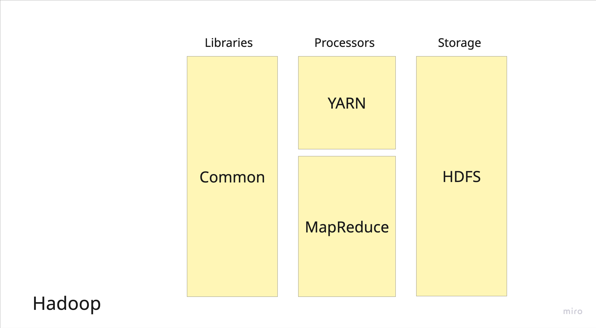
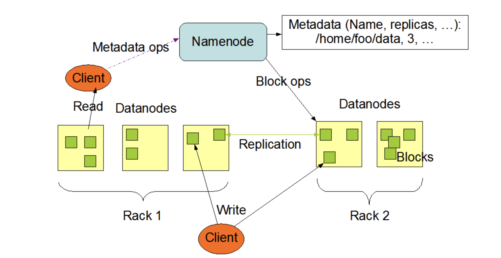
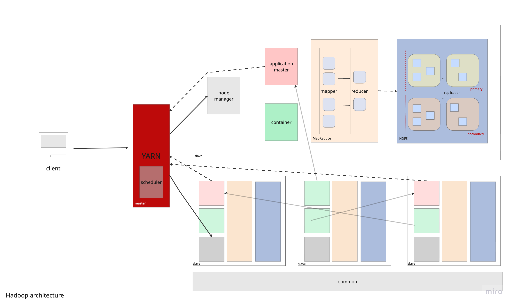

# Hadoop

## What's Hadoop?
Hadoop is an open-source software framework developed in the United States that enables the distributed processing of large data sets that runs on commodity hardware. It is primarily written in Java and utilizes the MapReduce programming model, which allows developers to write applications in various programming languages. Hadoop is designed to scale up from a single server to thousands of machines, each offering local computation and storage, making it a powerful solution for big data processing and analytics.

## Brief Overview

- Systems Embedded:
    - HDFS (core storage layer)
    - MapReduce (processing framework)
    - YARN
    - Hadoop Common Libraries
- Systems Inspired By:
    - Google File System
    - Google MapReduce
- Systems Compatible With:
    - Apache Hive (SQL-like interface)
    - Apache HBase (column-family store on HDFS)
    - Apache Spark (can run on Hadoop/YARN)

---

### Components

*Figure 1: Core components of the Hadoop ecosystem including HDFS, MapReduce, YARN, and related tools.*

**Author:** Alina Zacaria

*Figure 3: HDFS architecture showing the NameNode and DataNode components.*

**Author:** Apache Hadoop

## History

Hadoop came out of the same general problem space that companies like Google were dealing with early on, how to store and process massive amounts of search and web data across lots of machines. Back then, traditional databases just did not scale well enough for that kind of workload. Google solved this internally with systems like MapReduce and the Google File System, but those were not publicly available.

That is where Hadoop comes in. It started it off in 2002 with Doug Cutting and Mike Cafarella as they were working on the Apache Nutch project. Around 2008, Hadoop was released as an open source project from Yahoo! when Doug Cutting joined. He took the ideas from Google’s MapReduce paper, originally published by Google engineers, and built an open source implementation with Apache Software Foundation (ASF) that anyone could use which was officially released in 2012 [12]. But it did not stop at just copying MapReduce, it turned into a full ecosystem that engineers could actually build on and extend and is maintained til today by the ASF.

At its core, Hadoop is made up of a few fundemental components. HDFS, the Hadoop Distributed File System, handles storage by splitting data across multiple machines and replicating it for fault tolerance. Then you have YARN, which manages cluster resources and schedules jobs so everything runs efficiently across nodes. On top of that foundation, a whole set of tools grew over time, like Hive for SQL like queries, Pig for dataflow scripting, and HBase for NoSQL style access [8]. These tools made Hadoop much more practical for real world use, especially for companies that did not want to build everything from scratch.

Instead of being locked inside Google, Hadoop gave regular organizations a way to run large scale distributed data processing on their own hardware. That made big data infrastructure accessible to a much wider range of engineers and businesses, and it is a big reason why the whole big data movement took off the way it did.

## Bigger Picture

*Figure 2: Overview of the Hadoop architecture, illustrating the components and their interactions within the ecosystem.*

**Author:** Alina Zacaria

### Master-Slave Architecture

Hadoop follows a **master-slave architecture** where one or more master nodes coordinate and manage the cluster, while multiple slave (worker) nodes perform the actual data storage and processing.

#### Key Components:

- **NameNode (Master)** — *Highlighted in blue* — Manages the file system namespace and maintains the file system tree and metadata for all files/directories in HDFS. It does not store actual data.

- **DataNodes (Slaves)** — *Highlighted in green* — Store the actual data blocks and perform block creation, deletion, and replication based on NameNode instructions.

- **ResourceManager (Master)** — *Highlighted in blue* — Manages cluster resources and schedules jobs across the cluster via YARN.

- **NodeManagers (Slaves)** — *Highlighted in green* — Run on each worker node and manage task execution and resource usage locally.

This separation of concerns allows the master nodes to handle coordination and metadata, while slave nodes focus on computation and storage, enabling efficient distributed processing across the cluster.

## Technical Specs

- Operating Systems: all OS compatible with JVM (MacOs/Linux/Windows)
- Supported Languages: Java, and other strongly-typed languages with supported environments
- License: Apache Lisense 2.0
- Written in: Java, w/ minor C/C++ componenets

## Features

### Checkpoints
**Non Fuzzy - HDFS**. 
Checkpoints are in the form of periodic combining the snapshots and transaction logs (EditLogs) of metadata located in a secondary NameNode for ready-state recovery. 
Since EditLogs can get bigger over time, they are merged with the filesystem (FsImage), improving the performance of the system.

---

### Compression
**Block-level compression (Snappy, Gzip, LZO, Bzip2)**. HDFS can store compressed files, and MapReduce jobs can operate directly on compressed data depending on whether the format supports splitting to create the MapReduce input tasks. The algorithms used are Snappy, Gzip, LZO, and Bzip2 for purely compression, with Bzip2 being the only one that allows support for splitting, and therefore parallel processing with MapReduce [1].

---

### Concurrency Control

**Locks & Time-stamp ordering**. Hadoop - HDFS does not provide traditional transaction support. HDFS follows a write-once, append-only model with a single writer per file. But in the use case where multiple clients may want to read or write to the same file, Binary Locks are written to the NameNode that keeps two state locks for read and write only giving specific permission to the client. To prevent deadlock when multiple clients are pending to access the file but one client has a read lock, requests to the NameNode are numbered and their timestamp are stored so that specific rules in the NameNode will allow the greatest timestamp to read / write the file. So, the NameNode's time-ordering algorithm checks for two client requests that conflict, and then cancels the later one [11].

---

### Data Model

**HDFS - HBase, HDFS**. Hadoop is a multi-model system that supports structured, semi-structured, and unstructured data with HDFS by storing raw files. On top of HDFS, HBase provides an enhancement layer for unstructured (NoSQL) with wide-columns, and Hive helps with structured (SQL) querying [1].

---

### Foreign Keys

**Unsupported**. Hadoop does not support foreign key constraints directly as it is not a OLTP (online transactional processing) system.

---

### Hardware Acceleration
**N/A**. Hadoop is designed to run on commodity (inexpensive) hardware and does not natively rely on GPUs or FPGAs. Though optimization is recommended to leverage the parallel processing in MapReduce like mixing hot and cold data for heterogeneous storage or using higher memory or SSD as better commodity hardware components but not entirely an out-of-the-box solution [3].

---

### Indexes

**Inverted-Index (TFIDF)**
Indexing capabilities are provided by higher-level projects and tools in Hadoop. Hive provides functionality for range queries through B-/B+ trees. The most effective indexing is the inverted index which is a huge hashtable that stores and maps common terms with their associated files, making it useful for search engine optimization for constant lookup time [13].

---

### Isolation Levels

**N/A**. Since Hadoop does not support transactions, it does not define isolation levels such as READ COMMITTED or SERIALIZABLE.

---

### Joins

**Map-side joins, Reduce-side joins (via Hive/MapReduce)**. Join operations are implemented at the processing layer like in Hive. There are two main ways to perform joins: reduce-side joins and map-side joins. Reduce-side joins work like a sort-merge process, where data is grouped and combined after being sorted. Map-side joins, on the other hand, act more like hash joins and are used when one dataset is small enough to fit in memory. Both approaches are designed to run efficiently across many machines at once, allowing them to handle very large datasets by spreading the work across a cluster [1].

---

### Logging

**EditLogs**. In HDFS, the NameNode keeps track of all metadata changes (like creating files or changing replication factors) by recording them as entries in the EditLog, which is stored on the local file system. Instead of relying on traditional write-ahead logging for durability, HDFS mainly depends on replicating data blocks across multiple nodes [3]. One can use the Log4J library to extract logs from Hadoop runtime. See **Checkpoints** for snapshots for related info [7].

---

### Parallel Execution

**MapReduce**. Hadoop is designed for massive parallel execution. With the master-slave node architecture, MapReduce jobs are divided into many tasks that run across cluster nodes. This allows large datasets to be processed in parallel [6].

---

### Query Compilation

**Code generation (via Hive/Tez), JVM**. Hadoop excels with the JIT optimization provided by runtime from the Java Virtual Machine (JVM). Hive turns SQL-like queries into execution plans, which are then converted into MapReduce or Tez jobs for processing [1].

---

### Query Execution

**Iterative, Vectorized**. Hadoop/Hive run queries in a batch‑oriented, iterative execution model, where operators process data row by row by default. Hive can also flip into a vectorized mode for relational queries, processing data in column batches for better CPU efficiency [1].

---

### Query Interface

**Java Hadoop Libraries, WebHDFS REST API, C API libhdfs**. Hadoop provides multiple query interfaces depending on use case. At the core are the Java Hadoop libraries, which are standard for writing MapReduce jobs directly in Java or working with native Hadoop APIs [2]. For remote access, WebHDFS exposes HDFS over HTTP, enabling access from scripts or external services without a full Java setup. There's also libhdfs (the C API), a lower-level interface for C/C++ applications. Higher-level tools like Hive provide SQL-like interfaces (HiveQL) [1], and connectors exist for Python, R, and other languages [8].

---

### Storage Architecture

**Disk-oriented**. Hadoop is built as a disk-first system, meaning it's designed to store and process data that's way bigger than what you could fit in memory. Instead of relying on RAM, it spreads data across disks on multiple nodes in the cluster, so you can scale out and handle massive datasets without needing everything loaded in memory at once [8].

---

### Storage Format

**Text (JSON, CSV, XML), Parquet, Avro, ORC, RCFile, SEQUENCEFILE**. Hadoop supports multiple file formats [10]. Columnar formats like ORC and Parquet are optimized for analytics since they store data by column, making queries faster. Avro is row-based and includes built-in schema support, which makes it useful for handling schema changes over time. These formats plug directly into tools like Hive, where they're used as table storage formats [1].

---

### Storage Model

**NSM, DSM**. HDFS itself primarily supports default NSM. Row-oriented formats like Avro follow the NSM model, where full records are laid out together on disk. This works well for write-heavy workloads or cases where you're scanning entire rows sequentially. Columnar formats like ORC and Parquet follow the DSM model, where data is stored by column instead of by row, so queries that only touch a few columns can skip the rest and run more efficiently [10].

---

### Storage Organization

**Distributed file system (block-based)**. HDFS is built to handle very large files by splitting them into fixed-size blocks (typically 64 MB) and spreading those blocks across different DataNodes in the cluster [3]. Each block is replicated (usually 3 copies) to provide fault tolerance and high availability if a node goes down. A central NameNode keeps track of metadata (like block locations), while DataNodes store the actual data. HDFS follows a write-once-read-many model, meaning files are written once and then read multiple times, often at streaming speeds [3].

---

### Stored Procedures

**Unsupported**. Hadoop does not support stored procedures in the traditional DBMS sense as it is a file management system, so it will rely on Hive for that capability [1].

---

### System Architecture

**Shared-nothing**. Hadoop follows a shared-nothing architecture, where each node in the cluster has its own local storage and compute, with no shared memory or disk across nodes [4]. Data is partitioned across machines (via HDFS blocks), and computation is pushed to where the data lives, rather than moving data around. YARN takes care of the coordination aspect. Overall, this allows for scalable representation as each node is independent of its neighbors.

---

### Views

**Logical Views & Materialized Views (via Hive)**. Hive supports logical and materialized views that are defined by saved queries, meaning the data isn't stored separately but just the query definition [5]. When querying a view, Hive runs the underlying query on the data in HDFS.

---

## More Info

To learn more, visit the official [site](https://hadoop.apache.org): 

More Resources:  
[Wiki](https://simple.wikipedia.org/wiki/Apache_Hadoop) | [Official Docs](https://hadoop.apache.org/docs/current/) | [GitHub](https://github.com/apache/hadoop)

### References

1. Acceldata. (2025). *Hadoop with Hive: Scalable SQL Queries for Big Data Analytics*. Retrieved March 20, 2025, from [https://www.acceldata.io/blog/hadoop-with-hive-scalable-sql-queries-on-big-data](https://www.acceldata.io/blog/hadoop-with-hive-scalable-sql-queries-on-big-data)
2. Apache Hadoop. (n.d.). *MapReduce Tutorial – Prerequisites*. Retrieved from [https://hadoop.apache.org/docs/r1.2.1/mapred_tutorial.html#Prerequisites](https://hadoop.apache.org/docs/r1.2.1/mapred_tutorial.html#Prerequisites)
3. Apache Hadoop. (n.d.). *HDFS Architecture Guide*. Retrieved from [https://hadoop.apache.org/docs/r1.2.1/hdfs_design.html](https://hadoop.apache.org/docs/r1.2.1/hdfs_design.html)
4. Apache Hadoop. (n.d.). *Apache Hadoop YARN*. Retrieved from [https://hadoop.apache.org/docs/stable/hadoop-yarn/hadoop-yarn-site/YARN.html](https://hadoop.apache.org/docs/stable/hadoop-yarn/hadoop-yarn-site/YARN.html)
5. Apache Software Foundation. (n.d.). *Hive Language Manual — Materialized Views*. Retrieved from [https://hive.apache.org/docs/latest/language/materialized-views/#:~:text=Once%20a%20materialized%20view%20has,materializedview](https://hive.apache.org/docs/latest/language/materialized-views/#:~:text=Once%20a%20materialized%20view%20has,materializedview)
6. Dean, J., & Ghemawat, S. (2004). *MapReduce: Simplified Data Processing on Large Clusters*. 
7. Google Cloud. (n.d.). *Configure Syslog forwarding on Apache Hadoop*. Retrieved from [https://docs.cloud.google.com/chronicle/docs/ingestion/default-parsers/hadoop#:~:text=net%20start%20BindPlaneAgent-,Configure%20Syslog%20forwarding%20on%20Apache%20Hadoop,files%20(no%20web%20UI)](https://docs.cloud.google.com/chronicle/docs/ingestion/default-parsers/hadoop#:~:text=net%20start%20BindPlaneAgent-,Configure%20Syslog%20forwarding%20on%20Apache%20Hadoop,files%20(no%20web%20UI))
8. Google Cloud. (n.d.). *What is Hadoop?* Retrieved from [https://cloud.google.com/learn/what-is-hadoop](https://cloud.google.com/learn/what-is-hadoop)
9. IBM. (n.d.). *Hadoop vs. Spark*. Retrieved from [https://www.ibm.com/think/insights/hadoop-vs-spark](https://www.ibm.com/think/insights/hadoop-vs-spark)
10. IBM. (n.d.). *Support for Hadoop‑specific file formats (Db2 Warehouse documentation)*. Retrieved from [https://www.ibm.com/docs/en/db2‑warehouse?topic=movement‑support‑hadoop‑specific‑file‑formats](https://www.ibm.com/docs/en/db2‑warehouse?topic=movement‑support‑hadoop‑specific‑file‑formats)
11. Bansal, N., Upadhyay, D., & Mittal, U. (2014). Concurrency control techniques in HDFS. In *2014 5th International Conference - Confluence The Next Generation Information Technology Summit (Confluence)* (pp. 87-90). Noida, India. doi: 10.1109/CONFLUENCE.2014.6949251
12. Databricks. (n.d.). *What Is Hadoop?* Retrieved from [https://www.databricks.com/blog/what-is-hadoop](https://www.databricks.com/blog/what-is-hadoop)
13. Singh, A., & Kumar, A. (2015). *Inverted Indexing In Big Data Using Hadoop Multiple Node Cluster*. Retrieved from [https://thesai.org/Downloads/Volume4No11/Paper_22-Inverted_Indexing_In_Big_Data_Using_Hadoop_Multiple_Node_Cluster.pdf](https://thesai.org/Downloads/Volume4No11/Paper_22-Inverted_Indexing_In_Big_Data_Using_Hadoop_Multiple_Node_Cluster.pdf)